# **SOC Lab** : Détection & blocage automatique des attaques réseau (Scanning réseau, SSH Brute-force)

## 1. PRESENTATION DU PROJET & TOPOLOGIE

**Objectif** : Déployer une architecture SOC complète simulant des attaques réelles (**Scanning réseau** + **SSH Brute-force**) avec détection via **Suricata** et une réponse automatisée avec **Wazuh**.

### Topologie Réseau

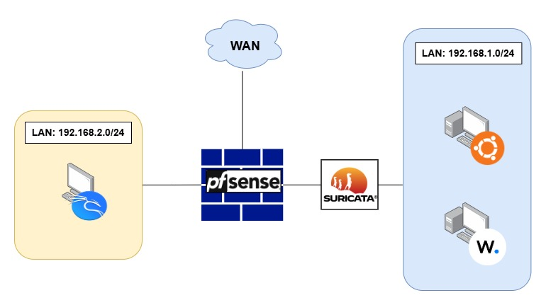

### 2. ÉLEMENTS CONSTITUTIFS DU PROJET

Ce projet sera constitué de :

1. **PfSense 2.8.1** : Utiliser pour ses services de filtrage du réseau, du routage entre nos LAN et pour l’utiliser comme serveur DHCP
2. **Suricata 7.0.8_5** : Pour la détection de nos différentes attaques
3. **Syslog-ng 1.16.2** : Transfert les logs de Suricata et Pfsense vers Wazuh
4. **Wazuh 4.11.1** : Utiliser pour surveiller les évènements dans le réseau et pour avoir une réponse active en cas de menace
5. **Wazuh Agent 4.11.1** : Pour permettre à Wazuh de mieux intéragir avec Ubuntu
6. **Kali Linux** : Système qui sera utiliser pour effectuer nos différentes attaques
7. **Ubuntu Server** : Système qui sera utiliser comme cible pour nos tests
8. **Adresse réseau** : 192.168.1.0/24, 192.168.2.0/24

## 3. DEPLOIEMENT

### 3.1 Prérequis - VMs (4 machines)

1. PfSense (WAN/LAN1/LAN2)
2. Wazuh (LAN1)
3. Ubuntu Server (LAN1)
4. Kali Linux (LAN2)

### 3.2 Configuration des interfaces sur pfSense

Status > Dashboard > Interfaces :

- WAN : em0 (DHCP Internet)
- LAN1 : em1 → 192.168.1.1/24
- LAN2 : em2 → 192.168.2.1/24

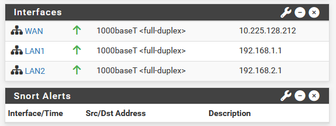

Services > DHCP Server :

1. LAN1 : 192.168.1.3 – 192.168.1.254
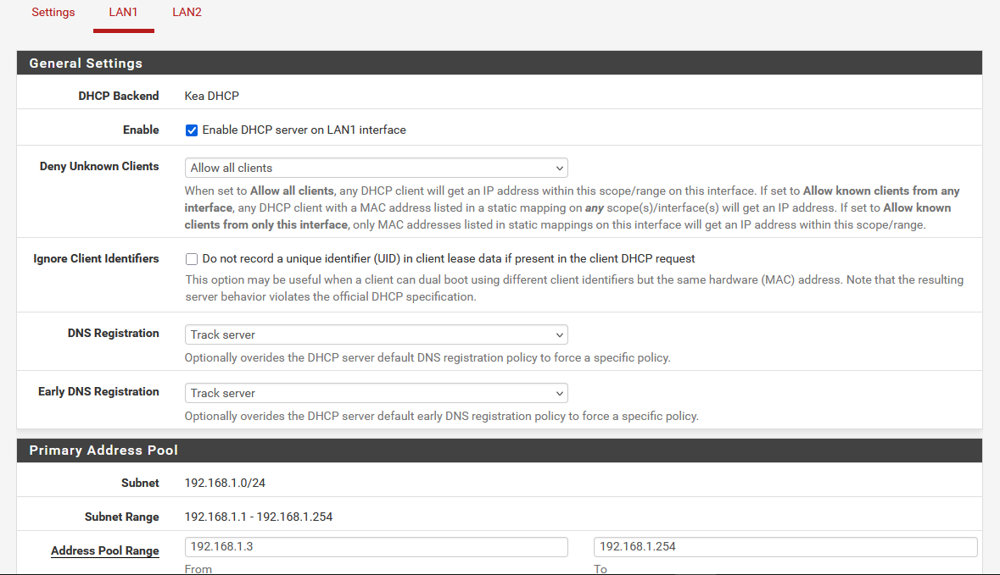

2. LAN2 : 192.168.2.2 – 192.168.2.254
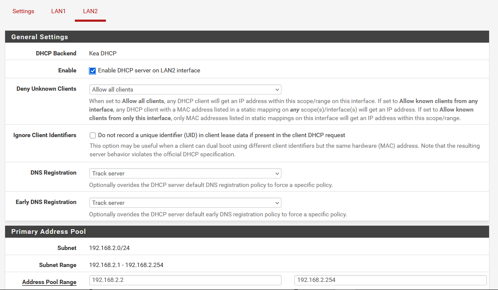

### 3.3 Configuration de Suricata IDS

Services > Suricata > LAN1 :

a) Enable : Cocher                // Pour activer la surveillance de Suricata sur cette interface

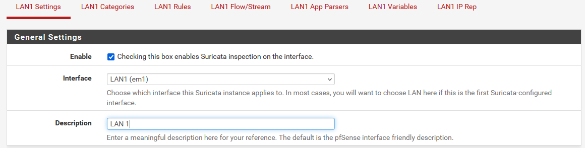

b) EVE JSON Log : Cocher          // Important pour le transfert des Logs de Suricata
c) EVE Output Type : FILE

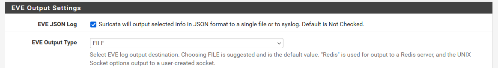

d) IPS Mode : Legacy Blocking     // Legacy pour utilizer le mode IDS de Suricata


### 3.4 Configuration de Syslog-ng

Configuration syslog-ng pfSense :

a) Dans "General"

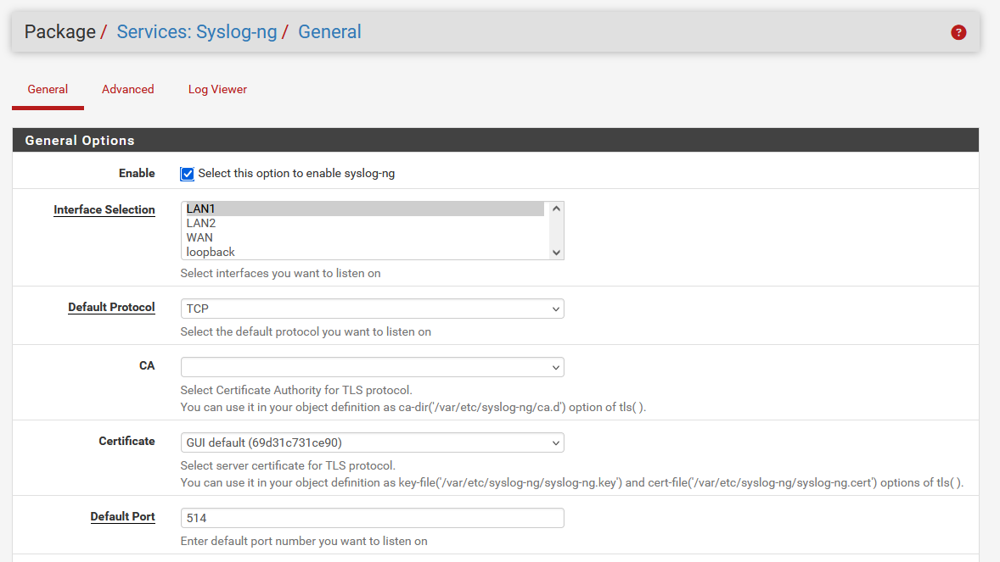

b) Dans "Advanced"

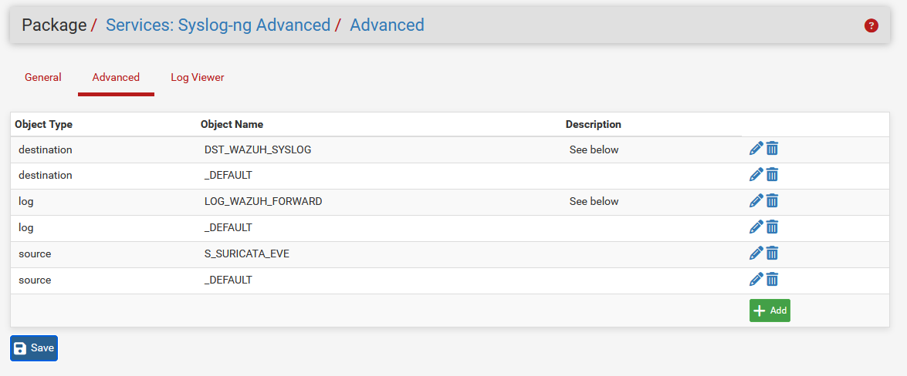

• Nouvelle config destination = DST_WAZUH_SYSLOG     // Destinataire des logs

```xml
{ network("192.168.1.2" transport("tcp") port(514)); };
```

• Nouvelle config source = S_SURICATA_EVE            // Source des logs

```xml
{ wildcard-file(
      base-dir("/var/log/suricata")
      filename-pattern("eve.json")
      recursive(yes)
      follow-freq(1)
      flags(no-parse)
       ); };
```

• Nouvelle config Log = LOG_WAZUH_FORWARD           // Chemin des Logs

```xml
{ source(_DEFAULT); source(S_SURICATA_EVE); destination(DST_WAZUH_SYSLOG); };
```

### 3.5 Wazuh - Active Response

Activation de l’Active Response sur Wazuh
sudo nano /var/ossec/etc/ossec.conf              Pour modifier le fichier de configuration de Wazuh avec nano.

```xml
<active-response>
   <disabled>no</disabled>
    <command>firewall-drop</command>
    <location>local</location>
    <rules_id>5710</rules_id>
    <timeout>600</timeout>
  </active-response> 
```

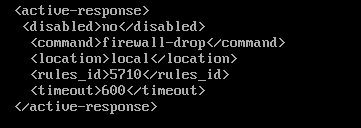

## 4. Tentative d’Attaques avec Détection et Réponse Active

### **ATTAQUE #1 : Scanning avec Nmap**

#### 4.1.1 Test de Connectivité Inter-LAN

Test effectué sur la machine Kali Linux
ping -c 4 192.168.1.5

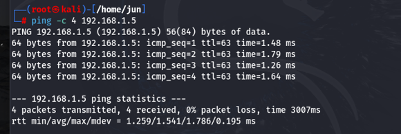

#### 4.1.2 Mise en place de l'attaque

Commande pour effectuer nortre Scanning vers Ubuntu

```bash
nmap -sV -A -T4 192.168.1.5
```

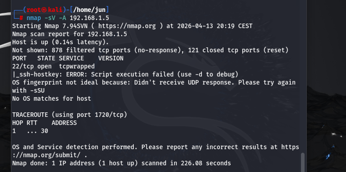

#### 4.1.3 Détection par Suricata

Aller sur Status > Suricata > LAN2 > Alerts

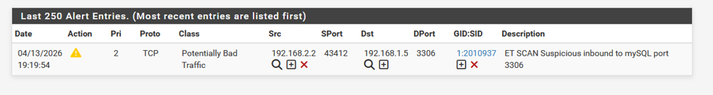

#### 4.1.4 Analyse des alerts de Wazuh

Ce rendre dans Threat Hunting > Events

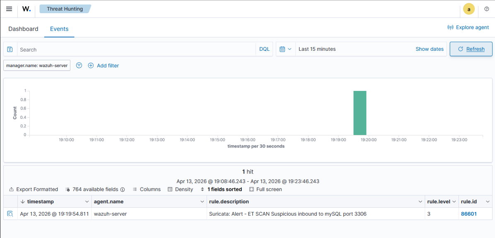

#### 4.1.5 Vérification Blocage

Test effectué sur la machine Kali Linux
ping -c 4 192.168.1.5

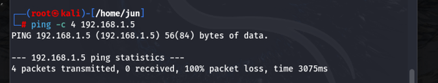

### **ATTAQUE #2 : SSH Brute-Force avec Hydra**

### 4.2.1 Test de Connectivité Inter-LAN

Test effectué sur la machine Kali Linux
ping -c 4 192.168.1.5

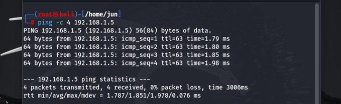

#### 4.2.2 Mise en place de l'attaque

Commande pour effectuer notre Brute force

```bash
Hydra -L username_list.txt -P password_list.txt 192.168.1.5 ssh
```

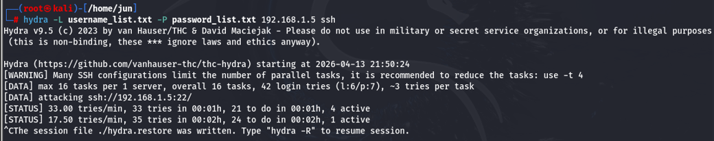

#### 4.2.3 Détection par Suricata

Vérification des Alerte sur Suricata

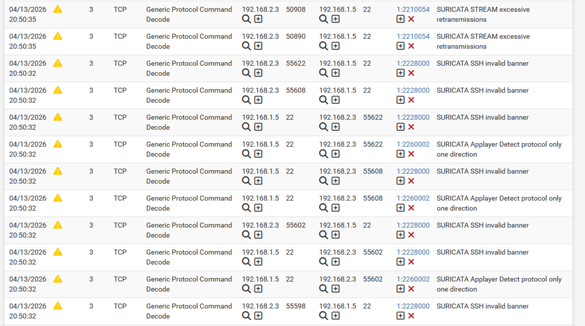

#### 4.2.4 Wazuh - Détection & Décision

Vérification des Alertes de Wazuh

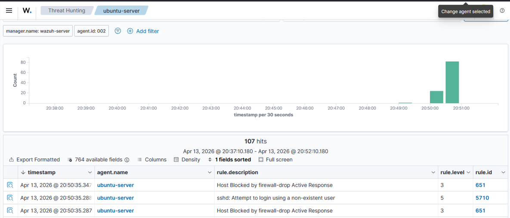

#### 4.2.5 Vérification Finale

Test de connectivité sur la machine Kali linux
ping -c 4 192.168.1.5

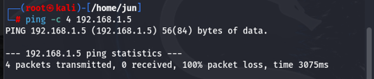

Skills Démontrés

1. **Réseaux Avancés** :  Routage inter-réseaux + DHCP avec Pfsense
2. **IDS/IPS** : Suricata configuration + Legacy Blocking
3. **SIEM** : Wazuh SIEM /Agent
4. **Log Management** : syslog-ng multi-sources → Centralisation Wazuh
5. **Active Response** : ossec.conf → **firewall-drop**
6. **Red Team** : Scan Nmap + SSH Brute Force avec Hydra
7. **Analyse Sécurité** : Chaîne complète Attaque→Détection→Réponse

```
